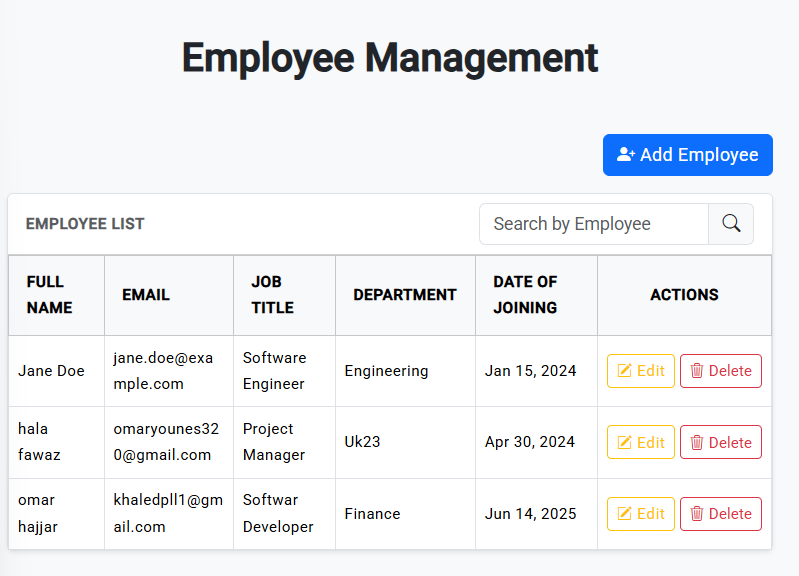
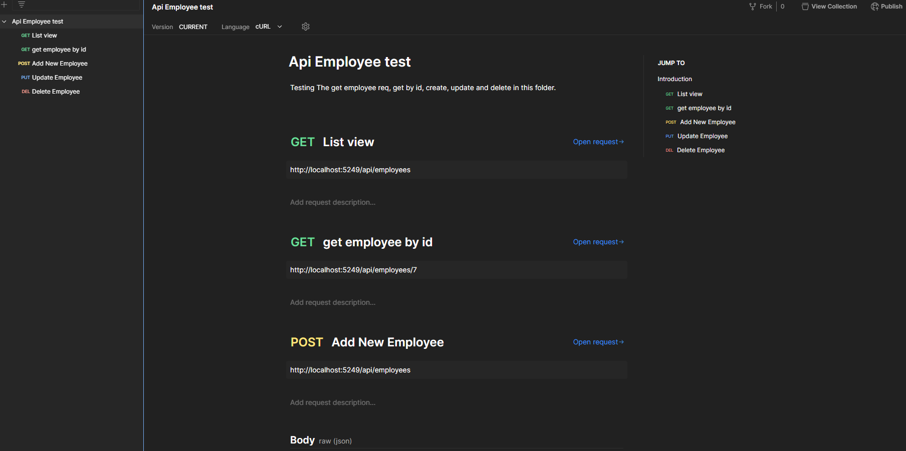

📌TECHNOLOGY USED: 

For Front-end: 

-node.js and npm

-Angular 18

For Back-end:

-.Net 9.0.6 SDK and Entity Framework Core

-Sql express server Database

----

📌HOW TO RUN THE APP:
1. Clone the repository from github

   Open visual studio and bash `git clone https://github.com/hamza-younes/Assignement-EM`

2. Navigate to the front-end folder `cd employee-management`.

   Then `npm install` to install the node_modules.

   Then `ng serve` to run the app.

3. Open a new terminal there and navigate to the back-end folder `cd Employee-Management-EM`.
  
   Then `dotnet watch run` to run the backend.

4. Visit the Link http://localhost:4200 and the project is ready

----

📌API DOCUMENTATION:

GET /api/employees - Get all the employees

GET /api/employees/{id} - Get an employee by ID  

POST /api/employees - Create a new employee  

PUT /api/employees/{id} - Update an existing employee   

DELETE /api/employees/{id} - Delete an employee  

----

📌POSTMAN API TEST:

Open postman and then you can import the file from the folder postman `Api Employee test.postman_collection.json`

---

📌SCREENSHOTS OF THE APP:

### App Homepage:

### Create Employee

### API Testing

